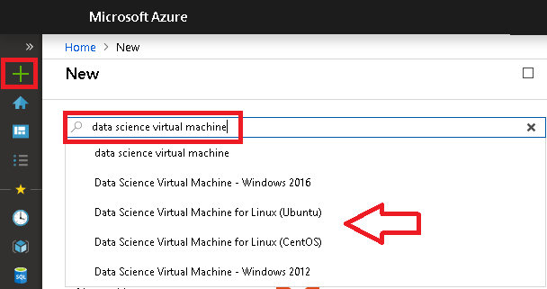
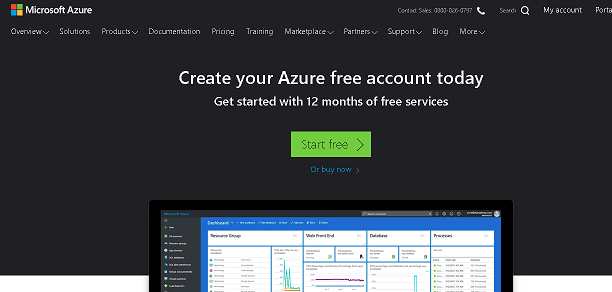
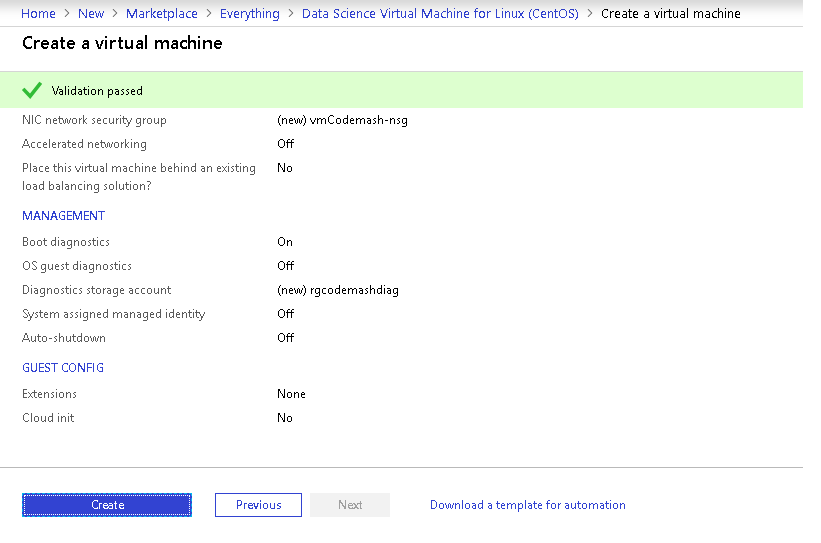
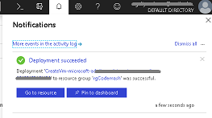
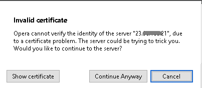
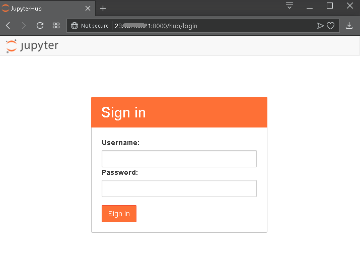
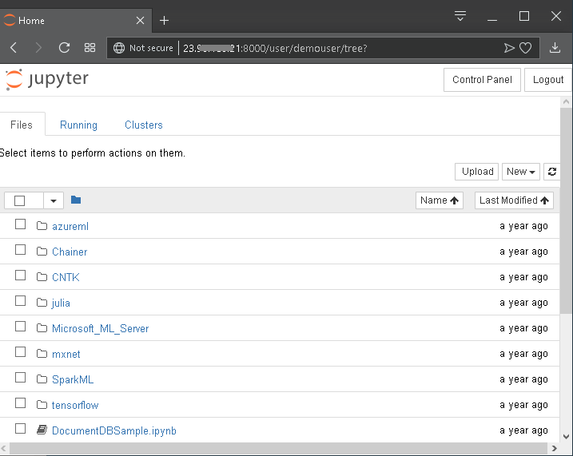
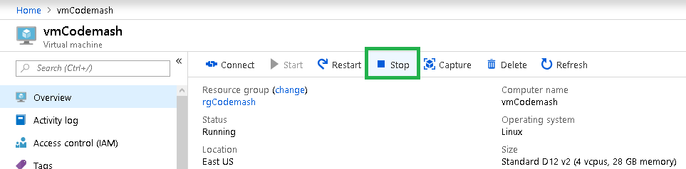

# ML-Tutorial-Codemash2019

## Pre-requisites

To maximize your tutorial time, please use the following steps to setup your environment on the cloud or on your local machine before arriving on the day.

### Setting up your working environment

For the tutorial we would require access to [Anaconda](https://www.anaconda.com) environment with Python 3.7.

> **NOTE:** That environment comes by default via an Azure Data Science Virtual Machine (a cloud virtual machine with a prepared data science environment) as described below in the Option 1, or you can install it on your local laptop as described in the Option 2. Please prepare your own environment if you are using any other cloud provider.

#### Option 1. Microsoft Azure subscription

1. Sign-in or create a new Microsoft Account if you don't have one by using [Microsoft Azure sign-up page](https://login.live.com/login.srf?lw=1). 

> **NOTE:** Don't use your corporate email address if you cannot use your corporate Azure subscription for the tutorial. Also, please create a different account if you have used an Azure Trial offer against an existing Microsoft account previously.

##### Task 1. Create an Azure Data Science Virtual Machine

1. Go to the Azure Portal at <https://portal.azure.com>
2. Click **+** (or **+ Create a resource** ) and search for "Data Science virtual machine"

    

3. Select one of the options and click "Create" at the bottom of the page. **[Note]** The steps below are for **"Data Science Virtual Machine for Linux (CentOS)"**.

4. **[Optional]** If you don't have existing Azure account, create one by clicking "Start free". That will open a separate page to create a trial azure account. Please follow the steps required and then return and refresh the Azure portal (Step 1 above)

    

4.  On the **Basics** blade provide the following inputs:

    a. **Resource group**: click "Create new" and type "rgCodemash" 

    b.  **Name**: vmCodemash

    c. **Region**: select either "South Central US" or "East US".

    d.  **Size**: click "change size" and on "Select a VM size" blade click "Clear all filters" and then search for "D12_v2". 
    
    e.  **Authentication type**: choose "Password"

    f.  **User name**: demouser

    g.  **Password** / **Confirm password:** provide yours (but make sure you remember it, as you'll need it)

> **NOTE:**  Depending on your type of Azure subscription, you may want to choose a large size VM, or a GPU-enabled machine, though this is not strictly required for the workshop. There are limitations about the number of cores that could be requested by default on a Trial subscription.
    
5.  Click **Review + create** button for your VM to be provisioned.

8.  Once validation scripts passed successfully, click **Create** button

    

9.  The VM should take a few minutes to provision

##### Task 2. Verify access to Jupyter Hub on the Data Science VM

1.  When the VM is ready, you should see a notification. Select **Go to resource** to view the deployed VM in the Portal.

    

2.  On the blade for the VM copy **Public IP address" for your machine.

    

3.  Go to the browser and type **https://(your VM's ip address):8000** to sign-in to Jupyter Hub 

4. You might  see a pop-up with a warning for an invalid certificate Click **Continue anyway** in that case: 
    

5.  In the sign in window provide your username and password as provided during the VM Provisioning steps

    

6. Confirm that you can see the root directory in the Jupyter hub

##### Task 3: Stop the VM

If you are performing this setup a day before the tutorial, you can optionally Stop the VM to save on costs overnight, and resume it when you are ready to start on the day. Follow these steps to Stop the VM:

1.  Return to the Azure Portal

2.  Navigate to the blade of your vmCodemash

3.  Select the **Stop** button

    

> **NOTE:** When you are ready to re-start the VM, simply follow the previous steps and instead of selecting Stop, select **Start**. Your VM will take a couple of minutes to start, after which you can connect to Jupyter Hub as above.

#### Option 2. Use your laptop 

> **NOTE:** Depending on your laptop specs, you may have some issues following all steps in Part 4 Deep Learning module.

1. Install Anaconda environment using the [official Downloads page](https://www.anaconda.com/download/).

2. The detailed guides on how to install it based on your OS are available [here](http://docs.anaconda.com/anaconda/install/).

3. Once installation is successful, try running your first Python as described [here](http://docs.anaconda.com/anaconda/user-guide/getting-started/)

4. For tutorials we expect you to use either an editor or Jupyter Notebook environment (as described in step 3)